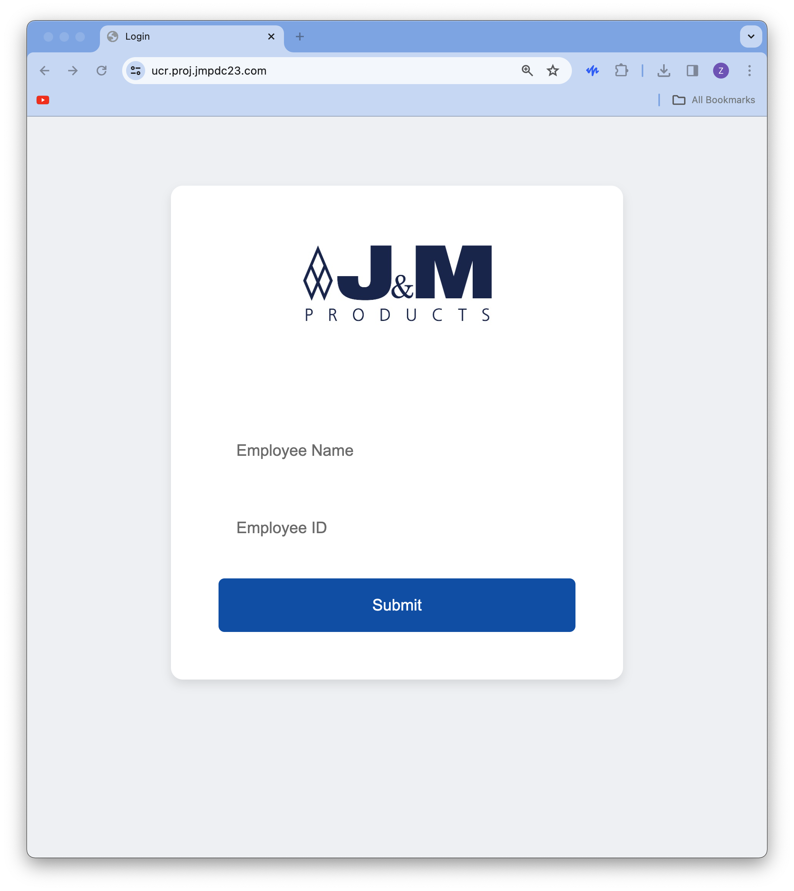
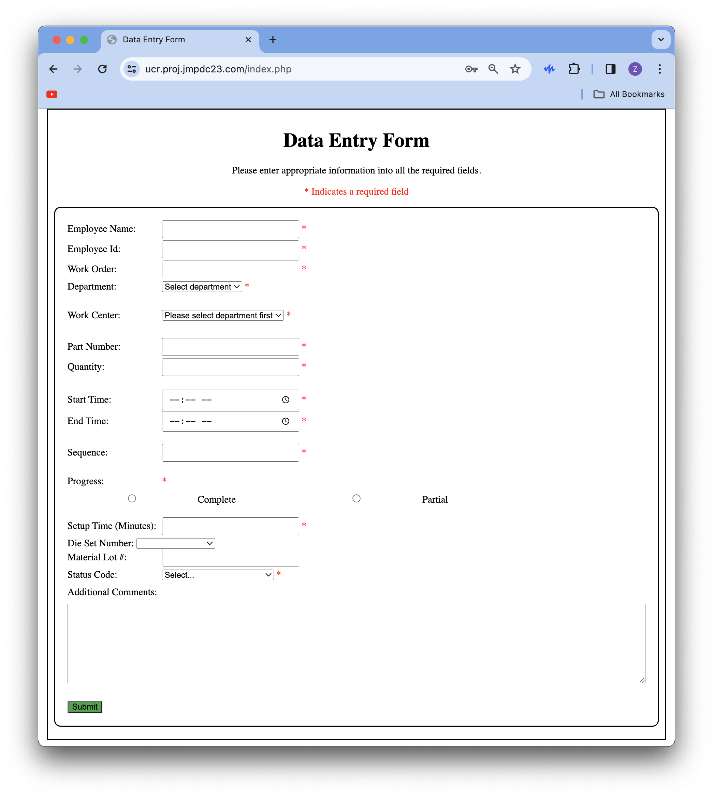
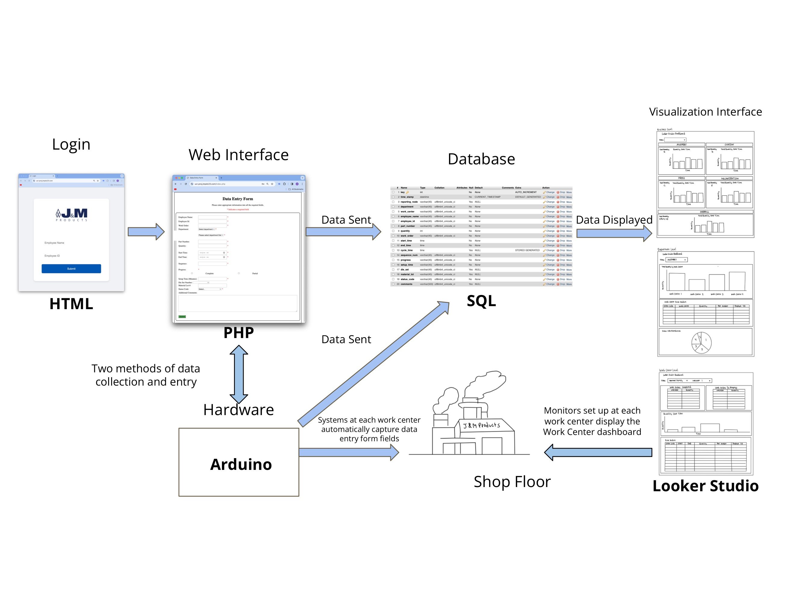
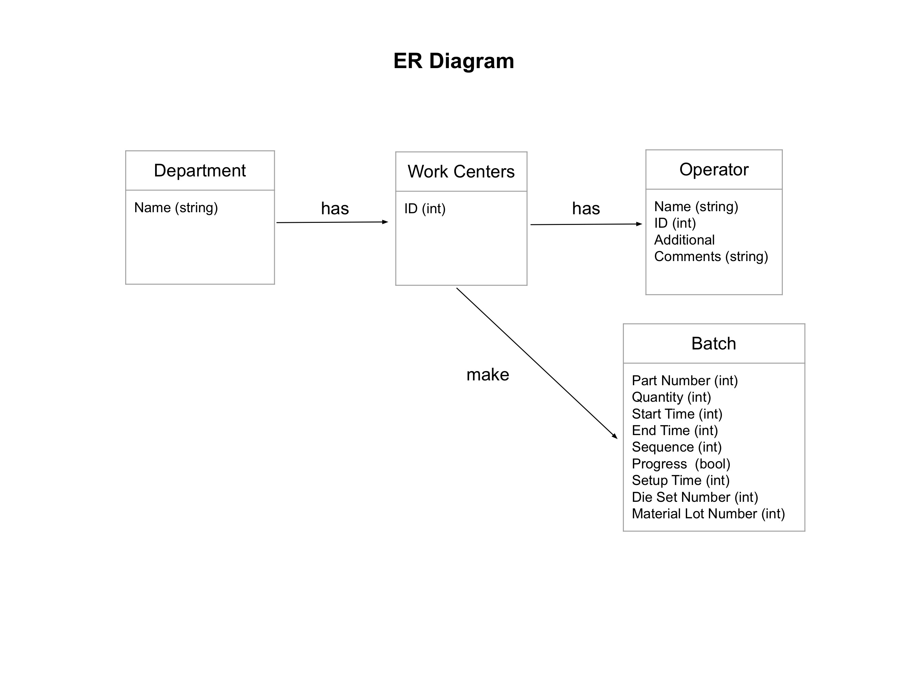

# Real-Time Data Collection and Reporting

## Table of Contents
- [Overview](#overview)
- [Download](#download)
- [How to Run](#how-to-run)
- [Diagrams](#diagrams)
- [Kanban](#kanban-board)
- [Dependencies](#dependencies)

## Overview
This project is done in conjunction with J&M Products, Inc., a manufacturing company located in San Fernando, CA, since 1963. J&M manufactures parts such as clamps and wire harnesses for use in aerospace/transportation environments using older technology machinery (1960s/1970s technology). The goal of this project is to create a database and interfaces that allow the automated capture of machine performance and review of the data in an easy-to-read format. 

This system is comprised of four primary components
- Web Interface (powered by HTML/PHP)
- Database (powered by MySQL)
- Visualization Dashboard (powered by Looker Studio)
- Hardware (powered by Arduino)

J&M prefers basic technology hosting services. Machine operators log in to a web interface and send information to a database developed using PHP/MySQL hosted on A2 Hosting (MySQL to avoid access/longevity/incompatibility issues found in applications such as Microsoft Access). However, the output from the database is presented graphically using Looker Studio. Furthermore, the automated data entry capture is facilitated by physically collecting data from the machines using switches and sensors and locally placed Arduino microcontrollers to collect information. 

## Team
<a href="https://github.com/atangit77" target="_blank">Andrew Tang </a>

<a href="https://github.com/Jweng1999" target="_blank">Jonathan Weng </a>

<a href="https://github.com/sooryasaravanan" target="_blank">Soorya Saravanan </a>

<a href="https://github.com/zacharygreen2003" target="_blank">Zachary Green </a>

## Download
From a terminal window, use the code below to clone the repository to your local machine
```
git clone https://github.com/UCR-Senior-Design/course-project-jm.git
```

## How to Run
In the project directory, you can satisfy dependencies by first downloading [PHPUnit](https://phpunit.de/getting-started/phpunit-10.html). As opposed to GoogleTest for languages such as C++, PHP code requires PHPUnit to administer unit tests. At this point, we assume that you're running PHP 8.1.0-8.2.0.

Then, download [Composer](https://getcomposer.org/), a dependency manager for PHP.

Finally, install PHPUnit inside the **UnitTests** folder with Composer.

Once PHPUnit is set up and running, run 
```
./vendor/bin/phpunit tests
```

If you installed PHPUnit using Composer outside of the **UnitTests** folder, run
```
./../vendor/bin/phpunit tests
```
Now, you should be up and running, at least on the server side.

The web address for the web interface is found [here](https://ucr.proj.jmpdc23.com/). 

To access, add, delete, or modify files on the web server, install a FTP client. A recommended FTP client is [Cyberduck](https://cyberduck.io/). Please use the credentials provided by your supervisor.

Now, you're ready to use this system on the shop floor!

As a machine operator, the first thing you'll see is the login screen.

Enter your credentials, then press **Submit**.

You'll then be taken to the web interface screen.

The web interface includes different data entry fields, most labeled as “required.” Many of these fields also contain dropdown menus and/or autofill options. You also may leave additional comments when you enter machine output data into the database so you can notify supervisors of any discrepancies or unusual occurrences. Fill in all the required fields, then once you're finished, press **Submit**.

Finally, from a supervisor perspective, you may log in to the database via [phpMyAdmin](https://ucr.proj.jmpdc23.com/phpMyAdmin/index.php). Here, you can view/modify the raw mySQL data. The database is not shown in this README to protect sensitive information and avoid any data breaches.

## Diagrams

### Overall System Diagram 
  

### Sequence Diagram  


### ER Diagram  


## Kanban
[This](https://github.com/orgs/UCR-Senior-Design/projects/19) is where we are tracking epics, user stories, and tasks.

## Dependencies
[PHP 8.1.0-8.2.0](https://www.php.net/downloads.php)  
[PHP Unit 10](https://phpunit.de/getting-started/phpunit-10.html)  
[Composer 2.6.6](https://getcomposer.org/)
